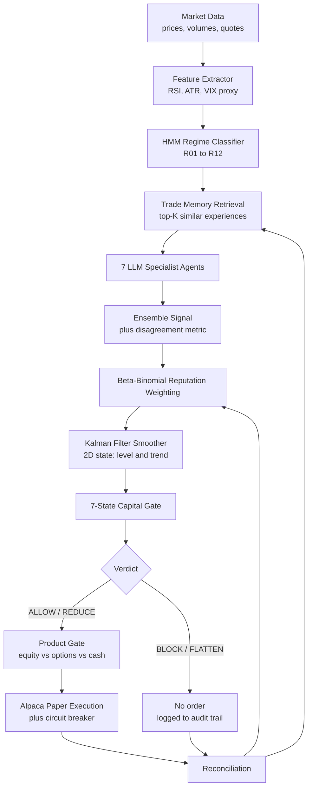
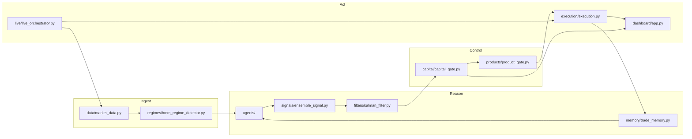
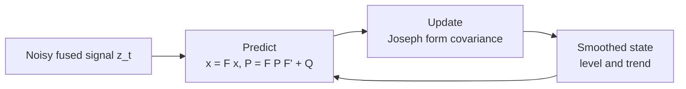
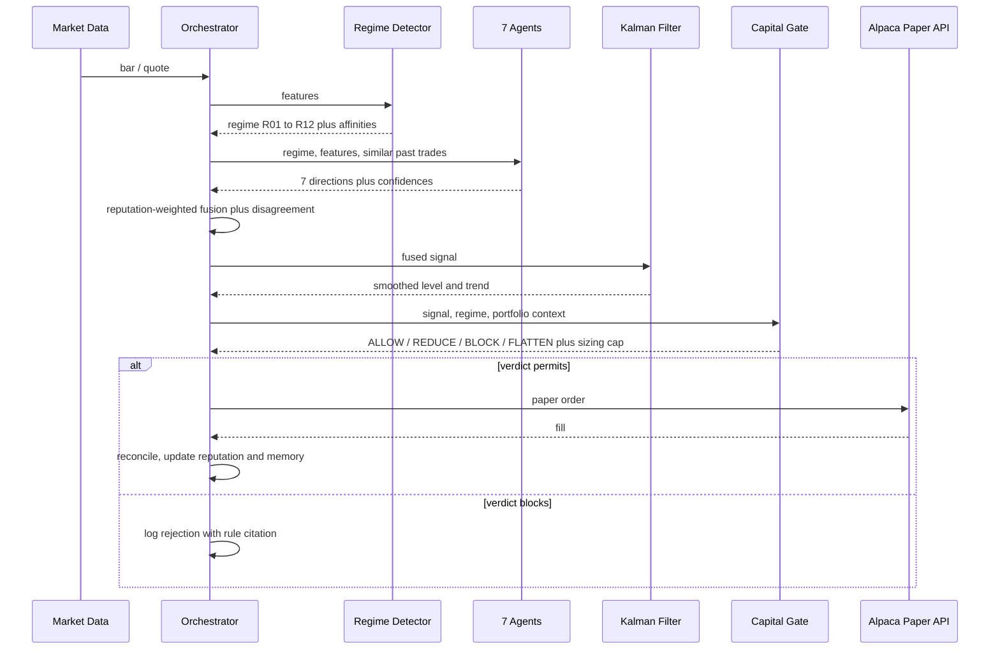
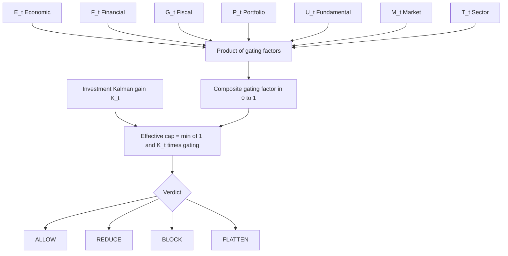

# X Quant X — Long-Form Project Description

## Table of Contents

- [1. Abstract](#1-abstract)
- [2. Keywords](#2-keywords)
- [3. Executive Summary](#3-executive-summary)
- [4. The Problem](#4-the-problem)
- [5. The Approach](#5-the-approach)
- [6. System Architecture](#6-system-architecture)
- [7. Component Walkthrough](#7-component-walkthrough)
- [8. The Decision Lifecycle](#8-the-decision-lifecycle)
- [9. Risk Model — The Seven-State Capital Gate](#9-risk-model--the-seven-state-capital-gate)
- [10. Engineering Evidence](#10-engineering-evidence)
- [11. What This Project Does Not Claim](#11-what-this-project-does-not-claim)
- [12. Scope Boundaries](#12-scope-boundaries)
- [13. Roadmap](#13-roadmap)
- [14. References](#14-references)
- [Changelog](#changelog)

---

## 1. Abstract

X Quant X is an autonomous, multi-agent quantitative **paper-trading** platform
built on the Alpaca paper-trading API. It converts market data into risk-gated
paper orders through a fixed, auditable pipeline: feature extraction, HMM regime
classification, trade-memory retrieval, seven independent LLM specialist
opinions, Beta-Binomial reputation weighting, Kalman-filter smoothing, a
seven-state capital gate, product selection, and Alpaca execution — followed by
reconciliation that feeds outcomes back into reputation and memory. This document
is the long-form submission narrative and the reference for the presentation deck,
PDF, and video artefacts in this directory.

## 2. Keywords

alpaca, architecture, beta-binomial, capital-gate, hmm, kalman-filter, lablab,
multi-agent, paper-trading, quantitative-finance, regime-detection, risk-gate

## 3. Executive Summary

Most retail-facing trading automation collapses a complex, non-stationary market
into a single predictive model and a single number. X Quant X takes the opposite
position: **the market is not one thing, and no single model should be trusted to
say what it is.**

The platform therefore does three things that a single-model system cannot:

3.1. **It measures the regime before it measures the opportunity.** A Hidden
Markov Model classifies the current environment into one of twelve archetypes
(R01–R12). Every downstream component is conditioned on that classification.

3.2. **It keeps disagreement visible.** Seven specialist agents look at the same
market through seven different lenses — Economic, Financial, Fiscal, Portfolio,
Fundamental, Market, and Sector. Their *disagreement* is computed and carried
forward as a first-class quantity, not averaged away.

3.3. **It gates capital before it gates opinion.** A seven-state capital gate sits
between the signal and the broker. It can ALLOW, REDUCE, BLOCK, or FLATTEN, and it
does so on the basis of measured capacity in each of seven state dimensions — not
on the basis of how confident the model happens to feel.

## 4. The Problem

4.1. **Non-stationarity.** A strategy calibrated on a low-volatility bull tape is
not merely less profitable in a liquidity crisis; it is a different problem. A
system with no explicit regime variable cannot express that distinction, so it
silently applies the wrong policy at the worst possible moment.

4.2. **False consensus.** Ensembling models that share a feature set produces
agreement that looks like confidence and is actually correlation. Averaging hides
exactly the signal an operator most needs: *the models do not agree, and here is
by how much.*

4.3. **Risk applied after the fact.** Position sizing bolted on downstream of a
"buy" decision cannot prevent a structurally bad trade — it can only make it
smaller. Risk has to be a gate, not a scalar.

4.4. **Unfalsifiable claims.** A backtest curve is not evidence. Systems that
report only returns and never report their own test coverage, their own model
disagreement, or their own rejected trades are not auditable.

## 5. The Approach

X Quant X answers one question on every cycle:

> Given all information available at time $t$, what market regime is most probable,
> what risks dominate, and what portfolio action provides the best risk-adjusted
> response?

The answer is produced by a directed acyclic graph of typed operators. Each
operator has a single responsibility, a declared input contract, and a declared
output contract; none of them can reach around its neighbours to touch the broker.

## 6. System Architecture

### 6.1. End-to-end pipeline

### 6.2. Module map

### 6.3. Language boundaries

| Language | Role | Boundary rule |
| :--- | :--- | :--- |
| Python | Orchestration, agents, dashboard, execution | Owns all I/O and all broker contact |
| C++ | Numerical kernel (Kalman filter, covariance) | No networking, no file I/O, no broker SDK |
| Go | Concurrent data-plane services | Data transport only |
| Rust | Safety-critical numeric utilities | Pure computation |

The C++ kernel's isolation is enforced, not aspirational: it imports nothing
beyond `<Eigen/Dense>`, `<cmath>`, and `<stdexcept>`.

## 7. Component Walkthrough

### 7.1. Feature extraction and regime classification

Raw price and volume series are reduced to a bounded feature vector (momentum,
realised volatility via ATR, a VIX proxy, and volume profile). A Hidden Markov
Model maps that vector onto an affinity distribution over twelve regime
archetypes; the affinities are normalised to sum to 1.0, a property enforced by a
Hypothesis-generated property test rather than asserted in prose.

### 7.2. The seven specialist agents

| # | Agent | Lens |
| :--- | :--- | :--- |
| 1 | Economic State | Macro indicators, inflation, rate expectations, GDP trend |
| 2 | Financial State | Liquidity, credit spreads, yield-curve shape, systemic stability |
| 3 | Fiscal State | Government spending, debt issuance, taxation policy |
| 4 | Portfolio State | Current exposure, drawdown limits, leverage, diversification |
| 5 | Fundamental State | Earnings, valuation ratios, balance sheet, growth |
| 6 | Market State | Order-book dynamics, volume profile, volatility, momentum |
| 7 | Sector | Sector relative strength, industry tailwinds, cross-asset correlation |

Each agent emits a normalised direction $s_i \in [-1, 1]$ and a confidence. The
normalisation is deliberate: it separates each agent's analytical methodology from
the platform's decision representation, so a new agent can be added without
touching the aggregation layer.

### 7.3. Ensemble aggregation and disagreement

The fused signal is a reputation-weighted mean of the seven directions. Alongside
it the platform computes a **disagreement** statistic over the same seven inputs.
High disagreement does not veto a trade by itself, but it propagates into the
capital gate, where it reduces available capacity. Both quantities are bounded by
construction, verified by property tests over randomised seven-agent inputs.

### 7.4. Reputation weighting

Each agent carries a Beta-Binomial posterior over its own hit rate, updated on
every reconciled outcome. An agent that has been right is weighted up; an agent
that has been wrong is weighted down; a new agent starts at the prior and has to
earn its influence. Reputation state is persisted and restored across sessions, so
the learning loop survives a restart.

### 7.5. Kalman smoothing

The fused signal is treated as a noisy observation of a latent two-dimensional
state — level and trend — and smoothed by a linear Kalman filter using the
Joseph-form covariance update for numerical stability. This is the component
ported to C++ and verified to match the Python reference to full double precision.

### 7.6. Product gate and execution

Surviving decisions are routed to an instrument: equity, options, or cash. The
execution layer submits to the Alpaca **paper** endpoint only, behind an emergency
circuit breaker that can cancel all open orders and flatten all positions.

## 8. The Decision Lifecycle

## 9. Risk Model — The Seven-State Capital Gate

The gate models available capital as a **state of charge** across seven
orthogonal dimensions, each normalised to $[0, 1]$:

| Symbol | Dimension | Interpretation |
| :--- | :--- | :--- |
| $E_t$ | Economic | Macro growth engine |
| $F_t$ | Financial | Market plumbing and stress resilience |
| $G_t$ | Fiscal | Policy and stimulus capacity |
| $P_t$ | Portfolio | Capital resilience and drawdown headroom |
| $U_t$ | Fundamental | Valuation health and earnings sanity |
| $M_t$ | Market | Microstructure quality and liquidity |
| $T_t$ | Sector | Technology / adoption S-curve momentum |

Each dimension is mapped through a per-state threshold pair (`minimum`, `full`)
into an individual gating factor in $[0, 1]$. The composite gating factor is their
product:

$$
\Gamma_t \;=\; \prod_{d \in \{E, F, G, P, U, M, T\}} \gamma^{(d)}\!\left(S_t^{(d)}\right), \qquad \Gamma_t \in [0, 1]
$$

The product form is the point: **any single depleted dimension collapses the whole
gate.** A strong macro backdrop cannot buy permission to trade through a liquidity
hole. The effective capital cap is then $\min(1, K_t \, \Gamma_t)$, where $K_t$ is
the investment Kalman gain — capital is deployed in proportion to how much the
system has actually learned, scaled by how much capacity it actually has.

On top of the continuous gate sit ten discrete risk rules (`CONC-001` through
`EXEC-001`) covering concentration, leverage, drawdown, sector exposure,
liquidity, and execution timeout. Every rejection is written to an audit trail
with the citation of the rule that caused it — the dashboard renders that trail
directly, so a blocked trade is as visible as an executed one.

## 10. Engineering Evidence

The platform is held to the same evidentiary standard it applies to markets.
Every figure below is a recorded command output, not an estimate.

| Metric | Value |
| :--- | :--- |
| Automated tests | 868 passed, 14 subtests passed, 0 failed |
| Statement coverage | 82% of 6419 statements |
| C++ kernel tests | 11/11 GoogleTest passing |
| C++/Python numerical parity | Exact to full double precision |
| Test categories | unit, integration, performance, security, scalability, correctness (property-based) |
| Property-based testing | Hypothesis — gate bounds, ensemble bounds, regime-affinity normalisation |
| Security gate | `bandit -r src/` with a zero-high-severity assertion, plus a hardcoded-credential scan |

Two real defects were found and fixed by this discipline rather than by
inspection: a session-controller restart race, and an $O(n^2)$ scalability
characteristic in the replay engine traced to per-write full-file `fsync` in trade
memory. Both are documented with root-cause evidence in the engineering report.

## 11. What This Project Does Not Claim

11.1. **No returns, no Sharpe, no win rate.** None has been independently
verified, so none is stated anywhere in this repository's submission material.

11.2. **No live-money trading.** Paper endpoints only. The submission is a
demonstration of decision architecture and risk discipline, not of profitability.

11.3. **Coverage is 82%, not 100%.** The uncovered surfaces (dashboard callback
branches, HMM calibration internals, live-session error paths) are enumerated
explicitly in the engineering report rather than papered over.

11.4. **Mutation testing is configured but unexecuted** on this machine — the tool
requires WSL, which is unavailable here. Configuration is committed; the score is
not fabricated.

## 12. Scope Boundaries

**In scope (MVP):** Alpaca paper trading; real-time market-data ingestion; HMM +
Bayesian + Kalman regime inference; momentum / mean-reversion / macro-trend /
volatility signal operators; the ten-rule risk gate; mean-variance, risk-parity,
and minimum-variance portfolio construction by regime; the control-room dashboard;
options paper trading.

**Out of scope:** live-money trading, custody, client funds, regulated advice.

## 13. Roadmap

13.1. Execute mutation testing on a Linux runner and publish the surviving-mutant
report.

13.2. Close the coverage gap on dashboard and calibration paths.

13.3. Replace trade memory's full-file persistence with an append log, with an
explicit crash-recovery guarantee, to remove the replay engine's quadratic term.

13.4. Extend the C++ kernel beyond the Kalman filter to the gating-factor product.

## 14. References

14.1. `alpaca_paper_trading_specifications_x_quant_x/001_xquantx_concept.txt` — canonical concept and MVP scope.

14.2. `alpaca_paper_trading_specifications_x_quant_x/028_xquantx_risk_ruleset.txt` — the ten risk rules.

14.3. `alpaca_paper_trading_specifications_x_quant_x/027_xquantx_regime_archetypes.txt` — regimes R01 through R12.

14.4. `src/investment_agent/capital/capital_gate.py` — `SevenStateVector`, `compute_gating_factor`, `RiskVerdict`.

14.5. `CHATS/2026-09-02_archive-consolidation-regression-suite-REPORT.md` — verified test, coverage, and parity evidence.

14.6. `AGENTS.md` — agent roster and execution lifecycle.

14.7. `coding_stds/CodingStandardsRef/coding_stds/documentation/markdown_standards.txt` — governing document structure.

## Changelog

| Version | Date | Author | Description |
| :--- | :--- | :--- | :--- |
| 2026.1.0.0 | 2026-09-03 | Hadrian Hu | Initial creation. Long-form LabLab submission narrative with pipeline, module-map, Kalman, sequence, and capital-gate Mermaid visualisations; grounded engineering-evidence table; explicit non-claims section. |
